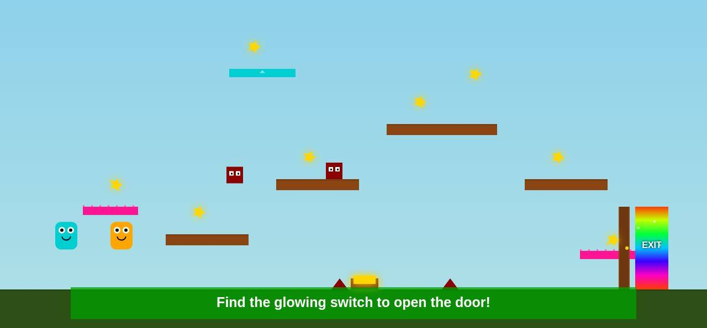

# Star Switch

A two-player platformer that runs in the browser: two kids share one laptop keyboard, or one plays with touch buttons on a phone or iPad. Built with TypeScript and HTML Canvas, no backend.

[](https://github.com/Jsingh-26/star-switch/actions/workflows/ci.yml)

[Play it](https://star-switch.vercel.app/) · [Android edition (in review, PR #1)](https://github.com/Jsingh-26/star-switch/pull/1)



## How it works

- **One canvas, one loop.** `src/game.ts` runs a fixed-step game loop (60 updates a second), handles collisions, the camera, stars, the switch and door, respawns and the win check.
- **Entities are small classes** in `src/entities/` (player, platform, star, enemy, spike, switch, door, exit, particles), each drawing and updating itself.
- **The opening screen picks the mode.** Laptop: both players at once on one keyboard. Phone or iPad: one player, a character choice and on-screen buttons. Easy / Medium / Hard add stars, enemies and spikes and speed up enemies.
- **Sound is generated in the browser.** `src/audio.ts` makes the effects and music with the Web Audio API and speaks praise with the Web Speech API.
- **Goal:** collect stars, stomp enemies, press Action at the glowing switch to open the door, then walk into the rainbow exit.

## Decisions

- **Fixed time step instead of one update per frame.** On 120 Hz screens the game ran faster than on 60 Hz ones. Updating physics in fixed 1/60 s steps (capped at 5 per frame) keeps the speed the same on every screen.
- **On phones the camera follows the player instead of shrinking the level.** Touch play is single-player, and the camera stays zoomed in on that character rather than scaling the whole desktop level down to fit a small screen.
- **The Android build stays on its own branch.** The Capacitor edition (native speech, update checks, Firebase distribution) sits in draft PR #1 until it passes review, so `main` stays a plain web game with no native code.

## Controls

| Player or device | Move left / right | Jump | Action (open the door at the switch) |
| --- | --- | --- | --- |
| Cyan character (keyboard) | A / D | W | S |
| Orange character (keyboard) | Left / Right arrows | Up arrow | Down arrow |
| Phone / iPad (one player) | On-screen Left / Right | On-screen JUMP | On-screen ACTION |

## Run locally

Needs **Node.js 22.12+** and npm.

```bash
git clone https://github.com/Jsingh-26/star-switch.git
cd star-switch
npm install
npm run dev        # open the URL Vite prints
npm run build      # TypeScript check + production build into dist/
npm run preview    # serve the built files
```

**Tests:** there are no automated tests yet. CI runs `npm ci` and `npm run build` (which includes the TypeScript compiler) on every push to `main` and every pull request.

## Project structure

| Path | Purpose |
| --- | --- |
| `index.html` | HTML shell and module entry point |
| `src/main.ts` | Device, difficulty and character selection; instructions and win screens; touch buttons; mute control |
| `src/game.ts` | Game loop, level setup, camera and canvas sizing, collisions, HUD |
| `src/entities/` | Game objects and their drawing and behavior |
| `src/audio.ts` | Web Audio sound and music, Web Speech praise |
| `src/style.css` | Screen layouts, buttons, touch controls |

## License

MIT

Made for Harbin and Agam.
